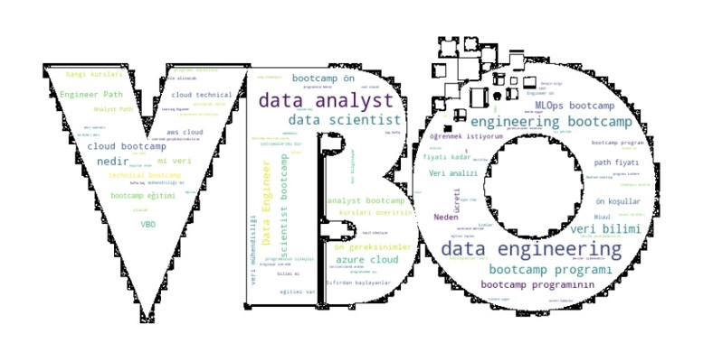
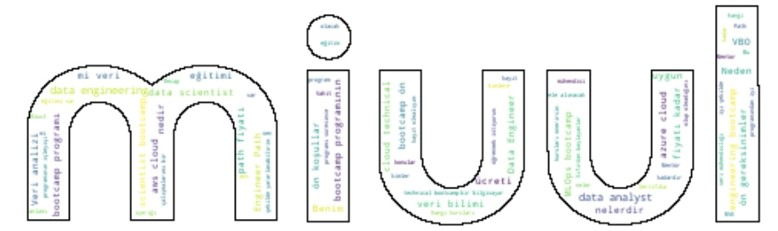

<h1 align="center">Turkish-Chatbot</h1> 

A chatbot is a computer program or an artificial intelligence (AI) that is designed to simulate human conversation through text or speech interactions. It is also commonly referred to as a conversational agent or virtual assistant.

Chatbots are programmed to understand and respond to user queries and provide relevant information or assistance. They can be integrated into various platforms such as websites, messaging apps, or voice assistants, allowing users to engage in conversations and receive automated responses.

There are different types of chatbots, ranging from rule-based chatbots to more advanced AI-powered chatbots. Rule-based chatbots follow a predefined set of rules and responses, while AI-powered chatbots use natural language processing (NLP) and machine learning techniques to understand and generate more contextually appropriate responses.

Chatbots can be used for a variety of purposes, such as customer support, information retrieval, task automation, and entertainment. They can improve efficiency by handling repetitive or common queries, provide 24/7 availability, and enhance user experiences by delivering personalized interactions.

<h3 align="left">Data Preparation</h2>

Necessary data is collected from the path education in Miuul websites and faq section of bootcamps in VBO websites. Question and answers are collected by using web scraping via BeautifulSoup library. But scraping data from websites is not enough for training a chatbot. So, we need more question and answers to train our chatbot. For this purpose, we added some questions and answers manually,then we saved it as a xlsx file.

This dataset covered subjects such as: bootcamp name, program location, program price, program duration, program start date, program end date, program description, program curriculum, program requirements ext.

The data is converted from xlsx file to json file so that chatbot returns the answer of the question that user asked.

<h3 align="left">Data Preprocessing</h2>

Firstly, we deleted html tags from the data. Then, we converted all the letters to lowercase. After that, we removed punctuation marks and stopwords, which are words that do not add meaning to the sentence, from our dataset.

Finally, we tokenized the data by using lemmatization. We used n-gram that creates combinations of words used together. Here, we created consecutive strings consisting of n elements according to the n number we determined.

<h3 align="left">Visualization</h2>

For visualization, we used word cloud. Word cloud is a data visualization technique used for representing text data in which the size of each word indicates its frequency or importance. Significant textual data points can be highlighted using a word cloud.

<h3 align="left">Modeling</h2>

We created neural network model by using Keras. We used ReLU activation function for the input layer and the hidden layers, and a softmax activation function for the output layer. We used categorical_crossentropy as the loss function, and the adam optimizer. We trained the model for 500 epochs. We saved the model as a h5 file.

<h3 align="left">Web Integration</h2>

We used HTML and CSS to design the interface of the chatbot website. We integrated the chatbot into the website with FLASK.

<h3 align="left">Output</h2>

